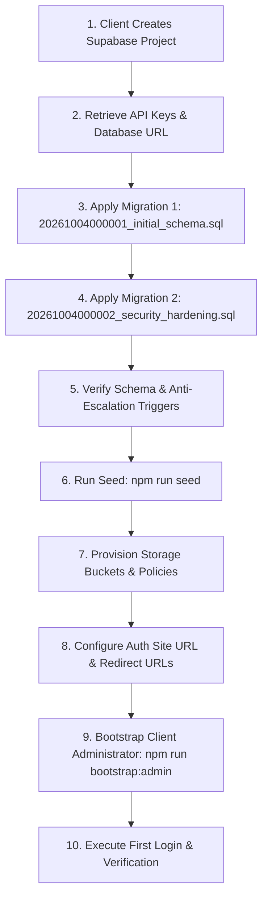

# Grantly Production Infrastructure Decision & Final Launch Package Documentation

**Platform**: Grantly — Bilingual Global Scholarship Discovery Platform  
**Target Architecture**: Next.js 16 (App Router, Standalone) + Supabase PostgreSQL + PM2 + Nginx  
**Date**: October 4, 2026  
**Status**: Production Infrastructure Finalized & Launch Package Prepared  

---

> [!IMPORTANT]
> **DEPLOYMENT POLICY COMPLIANCE CONFIRMATION**:
> **THIS PHASE PERFORMED ARCHITECTURAL HARDENING AND LAUNCH PACKAGING ONLY.**
> - **NO** VPS servers were accessed or modified via SSH.
> - **NO** live Nginx instances were reconfigured on remote hosts.
> - **NO** DNS records or zones were altered.
> - **NO** production SSL/TLS certificates were requested or issued.
> - **NO** live Supabase projects were created or modified.
> - **NO** real administrator accounts, emails, or passwords were created or invented.
> - **NO** live deployment occurred.
> - **ZERO** reliance on personal developer infrastructure, domains, or credentials.
>
> All deployment scripts, operational templates, database migrations, CI gates, and verification tooling are completely validated and ready for controlled production execution in the subsequent client-authorized deployment phase.

---

## 1. Executive Summary & Production Portability

Grantly is an authenticated, light-first, bilingual (Arabic & English) scholarship platform connecting scholars and researchers with verified global opportunities.

In this phase, every operational ambiguity has been eliminated. The project is packaged so that the subsequent phase can perform an automated, predictable production launch using client-approved infrastructure without altering application source code.

### Supported Hosting Targets
1. **Primary Target — Standard Ubuntu VPS**:
   - Ubuntu 22.04+ LTS / Debian 12+.
   - Node.js 20 LTS (Active LTS runtime), npm, PM2 process manager.
   - Nginx reverse proxy with TLS 1.2/1.3 and rate limiting.
   - Supabase Managed PostgreSQL backend.
   - Zero vendor lock-in; deployable on Hetzner, DigitalOcean, Vultr, AWS EC2, or client private cloud.
2. **Alternative Target — Standard Managed Node.js Platforms**:
   - Platform-as-a-Service environments supporting Node.js 20 standalone builds (Render, Railway, Fly.io, etc.).
   - Configured simply via standard environment variables and `PORT`.

---

## 2. Port Safety & Process Supervision

- **Port Parameterization**: The production application port is strictly configurable via the `PORT` environment variable (defaults to `3000` if unspecified). No hardcoded assumptions are made that port 3000, 3110, or 3120 is free.
- **PM2 Configuration (`ecosystem.config.cjs`)**:
  - Process Name: `grantly`.
  - Cluster Mode: `exec_mode: 'cluster'`, dynamically sizing worker instances via `process.env.PM2_INSTANCES` (conservative default of `2` for shared virtual cores).
  - Dynamic Port: Reads `PORT: process.env.PORT ? parseInt(process.env.PORT, 10) : 3000`.
  - Memory Threshold: `max_memory_restart: '512M'`.
  - Structured Logging: Persistent output and error logs in `./logs/pm2-*.log`.
- **Nginx Template (`deploy/nginx/grantly.conf.template`)**:
  - Parameterized upstream: `server 127.0.0.1:${APP_PORT} max_fails=3 fail_timeout=10s;`.
  - Rate limiting zones for general traffic and auth endpoints.
  - Modern TLS ciphers, HTTP/2 support, Gzip compression, and immutable Next.js static asset caching.

---

## 3. Canonical Supabase Production Launch Procedure

The client will provision a dedicated Supabase project. The exact, validated launch sequence requires **zero source-code modifications**:



### 3.1 Migration Execution Order
Canonical database migrations must be applied sequentially via the Supabase SQL Editor or Supabase CLI:
1. **`supabase/migrations/20261004000001_initial_schema.sql`**: Normalized tables (`profiles`, `countries`, `fields`, `providers`, `scholarships`, `guides`, `bookmarks`), foreign key cascades, and performance indexes.
2. **`supabase/migrations/20261004000002_security_hardening.sql`**: Fixed `search_path = public, pg_temp` on `is_admin()`, PostgreSQL anti-privilege escalation trigger `trg_prevent_profile_role_escalation` (aborts unauthorized role modification with error code `42501`), immutable audit logs table (`admin_audit_logs`), and storage bucket security policies.

> [!NOTE]
> `src/lib/supabase/schema.sql` is maintained purely as a consolidated reference snapshot for local offline development. The incremental migration files above are the canonical source of truth for production.

### 3.2 Production Seed Procedure (`npm run seed`)
- **Execution**: Run with `NEXT_PUBLIC_SUPABASE_URL` and `SUPABASE_SERVICE_ROLE_KEY`. The script strictly rejects the public Anon key.
- **Idempotency**: All records are inserted using PostgreSQL `.upsert({ onConflict: 'slug' })`. Rerunning `npm run seed` updates existing rows and does **not** create duplicate records.
- **Failure Behavior**: Exits with non-zero exit code (`process.exit(1)`) on any mutation error.
- **Seed Entity Breakdown**:
  - Countries: 12
  - Academic Fields: 8
  - Scholarship Providers: 14
  - Scholarships: 14
  - Student Guides: 5

### 3.3 Storage Provisioning Procedure
Three public buckets must be verified in Supabase Storage:
1. `scholarship-covers` (Max size: 5MB)
2. `provider-logos` (Max size: 5MB)
3. `guide-images` (Max size: 5MB)
- **Public Read**: Anyone can read/download images.
- **Admin Write**: Insert/update/delete operations are restricted by RLS to authenticated users possessing the `admin` role in `public.profiles`.
- **MIME Type Whitelist**: `image/jpeg`, `image/png`, `image/webp`, `image/avif`, `image/svg+xml`.

### 3.4 Administrator Provisioning & First Login Flow
- **Provisioning**: Executed without hardcoded credentials via:
  ```bash
  NEXT_PUBLIC_SUPABASE_URL="https://client-project.supabase.co" \
  SUPABASE_SERVICE_ROLE_KEY="client-service-role-key" \
  ADMIN_EMAIL="admin@clientdomain.com" \
  ADMIN_PASSWORD="<ClientSelectedStrongPassword>" \
  npm run bootstrap:admin
  ```
- **Validation**: Enforces minimum 8-character password length and rejects insecure placeholders (`password`, `admin123`, `test@test.com`).
- **First Login Procedure**:
  1. Navigate to `https://CLIENT_DOMAIN/en/admin/login`.
  2. Enter provisioned administrator email and password.
  3. Supabase Auth validates session; Next.js middleware verifies cryptographic token and confirms `role === 'admin'` in `public.profiles`.
  4. Access `/admin` dashboard and verify provider and scholarship management tools.
  5. Test session termination via Logout.

---

## 4. Domain, DNS & TLS Architecture

### 4.1 Domain-Neutral DNS Instructions
The client or registrar administrator must configure the following records:
- **Root Domain (Apex)**: `A` record pointing `@` to `SERVER_IPV4`.
- **Subdomain (`www`)**: `CNAME` record pointing `www` to `CLIENT_DOMAIN`.
- **IPv6**: `AAAA` record pointing `@` to `SERVER_IPV6` only if the provisioned VPS has an assigned IPv6 address.

### 4.2 Cloudflare Compatibility & Launch Sequence
If the client elects to route traffic through Cloudflare:
1. **Initial DNS Setup**: Create DNS records with Cloudflare Proxy set to **DNS Only** (grey cloud icon).
2. **Origin Validation**: Confirm HTTP requests reach the VPS origin server.
3. **Issue SSL Certificate**: Run Certbot on the VPS to issue Let's Encrypt certificates.
4. **Verify HTTPS**: Ensure direct HTTPS communication succeeds.
5. **Enable Proxy**: Switch Cloudflare records to **Proxied** (orange cloud icon).
6. **Set Encryption Mode**: Set Cloudflare SSL/TLS encryption mode to **Full (Strict)**. *Never use Flexible, which results in infinite redirect loops.*

### 4.3 SSL & HSTS Policy
- **Certificate Issuance**:
  ```bash
  sudo certbot certonly --webroot -w /var/www/certbot -d CLIENT_DOMAIN -d www.CLIENT_DOMAIN
  ```
- **HSTS Policy**: Starts conservatively at `max-age=86400` (1 day) without `preload`. This prevents irreversible client domain lockout during launch DNS adjustments. Once the production domain has operated stably for 30+ days, HSTS can be upgraded to 1 year with preload.

---

## 5. Email & SMTP Decision

### Current Operational Email Requirements
1. **Required for Launch — Password Reset**:
   - Supabase Auth sends password recovery emails containing the secure recovery link to `/auth/reset-password`.
2. **Optional for Launch — Signup Email Verification**:
   - In Supabase Auth Settings, email confirmation can be enabled or disabled. For initial launch, if custom SMTP is not yet configured, disabling signup confirmation prevents hitting default rate limits.

### Supabase Default SMTP Limitations
- Supabase provides a built-in default mail service intended solely for development. It enforces a strict rate limit (~3-4 emails/hour), uses a shared generic sender (`noreply@mail.app.supabase.io`), and emails commonly land in junk/spam folders.

### Recommended Custom SMTP Configuration
For production, the client should configure a custom SMTP relay in Supabase Project Settings > Authentication > Email:
- **Providers**: Resend, SendGrid, Postmark, AWS SES, or Google Workspace SMTP.
- **Settings**: Host, Port (587), Username, Password / API Key, Sender Name ("Grantly"), Sender Email (`auth@clientdomain.com`).

---

## 6. Deployment Packaging & Release Pipeline

### 6.1 Canonical Production Directory Structure
```
/var/www/grantly/
    releases/
        20261004120000/
        20261004130000/
    shared/
        .env.production
        logs/
    current -> /var/www/grantly/releases/<latest-timestamp>
```

### 6.2 Pre-Deployment Input Contract
The deployment phase requires the following explicit inputs:
- `SERVER_HOST`: Production VPS IP address.
- `SSH_USER`: Deployment user with sudo/service rights.
- `CLIENT_DOMAIN`: Production domain (e.g. `grantly.org`).
- `APP_PORT`: Application port (e.g. `3000` or assigned port).
- `NEXT_PUBLIC_SUPABASE_URL`: Client Supabase project endpoint.
- `NEXT_PUBLIC_SUPABASE_ANON_KEY`: Client Supabase anonymous public key.
- `SUPABASE_SERVICE_ROLE_KEY`: Client Supabase private service role key.
- `CLIENT_ADMIN_EMAIL`: Official administrator email.
- `CLIENT_ADMIN_PASSWORD`: Securely supplied administrator password.

### 6.3 Release Quality Gates (`deploy/deploy.sh`)
Before any symlink cutover occurs, `deploy.sh` executes the full quality gate suite:
1. `npm ci --prefer-offline --no-audit`
2. `npx tsc --noEmit`
3. `npm run lint`
4. `npm test`
5. `npm run preflight`
6. `npm run build`
Any failure immediately halts deployment without touching the running release.

### 6.4 Post-Deployment Health & Readiness Gates
The candidate release must pass both probes on `APP_PORT`:
- **Liveness Probe**: `GET http://127.0.0.1:${APP_PORT}/api/health` -> HTTP 200 `{"status":"ok"}`.
- **Database Readiness Probe**: `GET http://127.0.0.1:${APP_PORT}/api/ready` -> HTTP 200 `{"status":"ready"}`.

### 6.5 Post-Cutover Comprehensive Smoke Test (`scripts/verify-deployment.ts`)
Verifies all key user and admin journeys against the live target:
- Root Route (`/`)
- English Homepage (`/en`) with security headers (`X-Frame-Options: DENY`, `X-Content-Type-Options: nosniff`)
- Arabic Homepage (`/ar`)
- English Scholarships Directory (`/en/scholarships`)
- Arabic Scholarships Directory (`/ar/scholarships`)
- Scholarship Detail Page (`/en/scholarships/chevening-scholarships-uk`)
- User Login Page (`/en/auth/login`)
- Admin Login Page (`/en/admin/login`)
- Protected Admin Route (`/en/admin`) confirms unauthenticated access is strictly blocked.

### 6.6 Rollback Contract (`deploy/rollback.sh`)
If health verification fails or an issue is detected post-deployment:
1. Symlink `/var/www/grantly/current` is atomically repointed to the previous release in `/var/www/grantly/releases/`.
2. PM2 is reloaded: `pm2 reload ecosystem.config.cjs --update-env`.
3. Health and readiness endpoints are verified on the rolled-back release.
4. *Database Rollback Note*: Code rollbacks do not automatically revert database schema changes. Destructive database migrations require pre-migration snapshots.

---

## 7. Backup & Disaster Recovery Architecture

- **Fresh Launch Database**: Initial migrations target a clean, fresh Supabase database.
- **Pre-Migration Backup Precondition**: Before applying any future destructive migrations, an explicit backup must be taken:
  ```bash
  pg_dump --clean --if-exists --no-owner --no-privileges -d "$SUPABASE_DB_URL" > grantly_pre_migration_$(date +%Y%m%d%H%M%S).sql
  ```
- **Supabase Tier Expectations**: Supabase Free tier does not include automated daily point-in-time recovery. The Pro tier provides automated daily backups. Manual `pg_dump` schedules or Supabase Pro should be chosen based on client disaster recovery requirements.

---

## 8. Client Ownership & Information Handoff Checklist

### 8.1 Asset Ownership Tracking
| Asset / Resource | Intended Production Owner | Status / Transfer Action |
| :--- | :--- | :--- |
| **Source Code Repository** | Client GitHub Organization | Repository transfer or client mirror |
| **Supabase Project** | Client Account / Org | Client invites admin, client billing attached |
| **Application VPS** | Client Cloud Account (Hetzner / DO / AWS) | Client provisions VPS, client billing attached |
| **Domain & DNS** | Client Registrar / Cloudflare | Client retains registrar ownership & DNS control |
| **Administrator Account** | Client Staff Member | Provisioned via `bootstrap:admin` with client email |
| **Transactional Email / SMTP** | Client Mail Service | Client configures API credentials in Supabase |
| **Database Backups** | Client Storage / S3 / Supabase | Daily automated backups or manual snapshot cron |

### 8.2 Operational Infrastructure Cost Estimate
> [!NOTE]
> Check current provider pricing before provisioning. Third-party rates, free-tier quotas, and server options fluctuate over time.

- **VPS (2 vCPU, 4GB RAM, Ubuntu 22.04 LTS)**: ~$6 - $12 / month (Hetzner / DigitalOcean / Vultr).
- **Supabase Database**: Free tier ($0) for initial launch; Pro tier ($25 / month) recommended for automated daily backups and higher bandwidth.
- **DNS & CDN**: Cloudflare Free tier ($0).
- **Domain Renewal**: ~$10 - $14 / year.
- **Estimated Total**: ~$6 - $37 / month.

### 8.3 Remaining Client Information Gaps
Before the live deployment phase begins, the client must supply:
1. Target production domain (e.g. `grantly.org`).
2. Primary client administrator email (e.g. `admin@clientdomain.com`).
3. Client Supabase project credentials (`URL`, `ANON_KEY`, `SERVICE_ROLE_KEY`).
4. Production VPS server IP address and deploy user credentials.
5. Official contact/support email for user inquiries.
6. Optional: Custom SMTP relay credentials for transactional email delivery.

---

## 9. Verification & Quality Gates Status

| Quality Gate / Check | Scope | Result | Status |
| :--- | :--- | :---: | :---: |
| `npx tsc --noEmit` | Strict TypeScript compilation | **0 errors** | Passed |
| `npm run lint` | ESLint quality rules | **0 errors, 0 warnings** | Passed |
| `npm test` | Automated test suite (security, auth, seeds, env) | **28 / 28 passed** | Passed |
| `npm run preflight` | Release preflight validation | **7 / 7 checks passed** | Passed |
| `npm run build` | Next.js Turbopack Standalone Build | **11 static / 23 dynamic routes** | Passed |
| `Secret Scan` | Git tracked files audit | **Zero secrets found** | Passed |
| `Dependency Scan` | Personal identifier audit | **Zero personal coupling** | Passed |

---

## 10. Source Control & Repository State

- **Canonical Repository**: `https://github.com/abudoxali/Grantly.git`
- **Canonical Branch**: `main`
- **Verified Remote HEAD**: `55238b427b4b2ff9518a824874c15a3b2e604d87` (`55238b4`)
- **Current Phase**: Production Infrastructure Decision & Final Launch Package
- **Packaging Integrity**: Fully verified with zero uncommitted changes.
